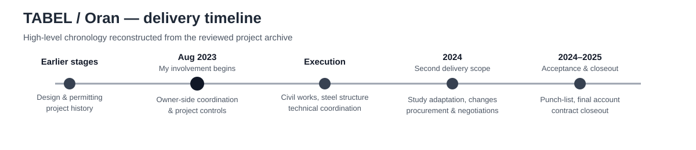
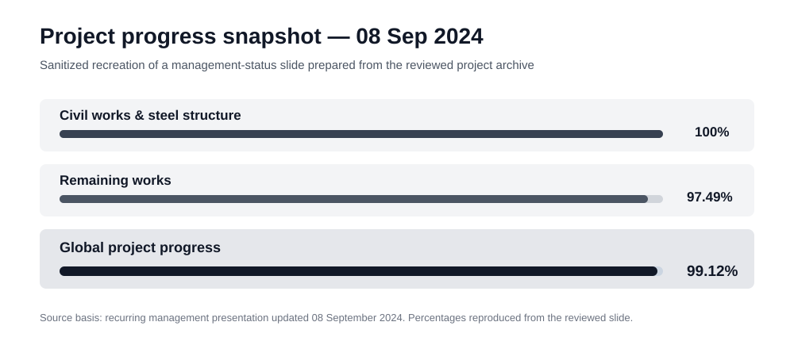

# New Meter Manufacturing Facility — Project Management Case Study

Industrial project-management case study from my work at **SAIEG — Sonelgaz Group** on the construction and delivery of a new **gas and electricity meter manufacturing facility in TABEL, Oran, Algeria**.

I joined the project in **August 2023** as an **Ingénieur d'études** and coordinated day-to-day delivery on behalf of the project owner through execution, provisional acceptance and closeout activities. My work combined planning, contracts, procurement, technical coordination, cost and payment follow-up, executive reporting, risk/issue management and stakeholder alignment.

## At a glance

| Area | Details |
|---|---|
| Professional context | SAIEG — Sonelgaz Group |
| Location | TABEL, Oran, Algeria |
| My direct involvement | August 2023 – May 2025 |
| Formal company title | Ingénieur d'études |
| Project responsibility | Owner-side project coordination and delivery |
| Facility | Gas and electricity meter manufacturing |
| Delivery structure | Two contractor scopes + two engineering-consultant / BET scopes |
| Main project work | Planning, reporting, contracts, procurement, technical coordination, financial follow-up, risk/issues, acceptance and closeout |
| Working tools | Microsoft Project, Excel, PowerPoint, Word |
| Delivery outcome | Main construction scopes reached provisional acceptance; closeout continued afterward |

## Project context

The project had already passed through earlier diagnostic, design and administrative stages before I joined it. My involvement began as execution became the main focus.

The delivery environment covered several buildings and technical disciplines, including civil works, steel structure, architecture, electrical systems, HVAC, fire protection, utilities and specialist infrastructure packages. It also required coordination between internal management, the engineering consultant (BET), the main contractor, technical control, laboratories and other technical or procurement stakeholders.

*High-level delivery chronology reconstructed from the reviewed project archive.*

A more detailed chronology is available in [Project Timeline](docs/project-timeline.md).

## My contribution

My work covered site execution and the wider project controls around it: planning, documentation, contracts, procurement, technical interfaces, financial follow-up and management reporting.

- Coordinated day-to-day project-owner follow-up across internal management, BET, contractor, technical control and specialist stakeholders.
- Monitored schedules, physical progress, open actions and delivery priorities using MS Project planning, progress trackers and recurring reviews.
- Prepared and updated project-status presentations and regularly presented progress, issues and actions to executive management.
- Prepared or maintained a substantial share of project-owner documentation.
- Prepared or substantially contributed to several **technical specifications / tender packages (cahiers des charges)** and participated in contractor and BET selection, technical evaluation and negotiation.
- Followed four core contract streams, including amendments, additional/complementary works, work orders, stop/resume controls and closeout documentation.
- Maintained project-level cost, payment and forecast follow-up across contracts, amendments, work-progress / payment statements, invoices and final accounts.
- Reviewed and used project drawings to understand interfaces, follow execution and coordinate study gaps or modifications.
- Followed technical-control observations, punch-list / reserve items, provisional acceptance and final-account / DGD activities.

## Planning, progress and reporting

I collected information from several parties and consolidated it into a working view of schedule, physical progress, open actions, technical issues and financial status.

The project archive contains a long sequence of dated progress presentations, planning revisions and monthly reports. I personally prepared and maintained the recurring project-status presentations and regularly presented them to central executive management, including the CEO. I also prepared recurring monthly reports for group-level reporting within Sonelgaz.

## Contracts, procurement and change management

The delivery phase was organized around **two contractor scopes and two engineering-consultant / BET scopes**.

My work included contract execution follow-up, amendments, additional and complementary works, work orders, schedule and scope impacts, price discussions, work-progress / payment statements and final-account documentation.

Procurement and specifications were also a recurring part of the role. Within the TABEL project, I prepared or substantially contributed to several cahiers des charges, consultation and contract packages, including the BET package and selected technical infrastructure packages. I also participated in contractor/consultant selection, technical offer evaluation and negotiations.

## Technical coordination and drawing follow-up

Project coordination regularly crossed discipline boundaries. I used drawings and technical documents as working references to understand interfaces and execution constraints, then coordinated questions, missing information, modified plans and technical-control comments with the relevant parties.

This work covered civil works, steel structure, architecture, electrical systems, HVAC, fire protection, utilities and other technical packages.

## Cost and payment follow-up

I maintained project-level financial follow-up alongside physical and contractual progress.

The working records covered contract and amendment values, work-progress / payment statements, invoices and payment status, forecasts, remaining commitments and final-account / DGD information. This gave management a consolidated view of where execution and financial status stood at each stage.

## Technical control, quality and acceptance

I also followed technical-control observations and punch-list / reserve items, coordinating the required responses with the BET, contractor and technical-control body. This work continued into provisional acceptance and the closeout of outstanding items.

## Representative issue: design interface and schedule impact

One documented issue combined a delay in steel-structure procurement with a design conflict around a freight-lift / foundation interface.

The follow-up required coordination between the contractor, engineering parties and technical control, review of the design problem, correction of the study, management of complementary works and tracking of schedule implications. Contractor commitments and formal notices were also part of the follow-up.

The experience from that phase was carried into the later scope by strengthening study-adaptation requirements and asking for earlier identification of plan gaps. The full summarized case is documented in [Representative Issue](docs/representative-issue.md).

## Project progression

The surviving project material documents the progression from active construction to a completed industrial facility and later production areas.

The working archive includes construction-stage photographs and later views of the completed facility and production areas. These source photographs remain private in the current public version; the case study instead publishes a sanitized lifecycle visual and a reconstructed progress snapshot derived from the original project reporting.

## Acceptance and closeout

The two main contractor scopes reached **provisional acceptance**. Follow-up then continued through punch-list / reserve closeout, final-account work, closeout amendments and contract and financial closeout activities.

## Evidence behind this case study

This case study is backed by a much larger surviving project archive. The table below shows the main evidence families reviewed for the case study.

| Responsibility / claim | Representative evidence reviewed |
|---|---|
| Planning & progress | MS Project schedules, planning revisions, progress trackers, recurring status presentations |
| Executive reporting | Dated project presentations and monthly/group-level reports |
| Contracts & change | Contracts, amendments, work orders, stop/resume records, negotiation minutes, additional/complementary-work files |
| Procurement & selection | Cahiers des charges, consultation packages, technical evaluations and negotiation records |
| Financial follow-up | Project financial tracker, work-progress / payment statements, invoice/payment follow-up, forecasts and DGD/final-account files |
| Technical coordination | Meeting minutes, plan revisions, study-gap records, technical-control observations and reserve files |
| Acceptance & closeout | Provisional-acceptance files, punch-list / reserve follow-up, closeout amendments and final-account documentation |

**Example of the recurring project-status reporting I prepared — September 2024**

*Sanitized recreation of a project-status slide I prepared for management reporting; values are reproduced from the reviewed 08 September 2024 presentation.*

The lifecycle graphic and progress snapshot provide public visual context. Raw photographs, contracts, detailed financial records, private correspondence, signatures, tender submissions and technical drawings remain private.

See [Evidence & Confidentiality](evidence/README.md) for the publication boundary.

## What this case study demonstrates

- Owner-side coordination of a multi-contract industrial project.
- Practical project controls: planning, progress tracking, action follow-up and executive reporting.
- Hands-on contract administration, change management, procurement and technical evaluation.
- Multidisciplinary technical coordination supported by drawings and engineering documentation.
- Cost, payment and final-account follow-up linked to physical and contractual progress.
- Issue resolution carried through technical correction, schedule/change follow-up, provisional acceptance and closeout.

## Professional context

During the same SAIEG period, I also served on **three short interim assignments as Acting Head of the Development Department** and worked on other development-department activities involving technical specifications, contracts, procurement, product approval and certification. Those activities are outside the scope of this TABEL case study so that the repository remains focused on the factory project itself.

## Related documentation

- [Project Timeline](docs/project-timeline.md)
- [Delivery & Controls](docs/delivery-and-controls.md)
- [Representative Issue](docs/representative-issue.md)
- [Representative Project Evidence](evidence/representative-artifacts.md)
- [Evidence & Confidentiality](evidence/README.md)
