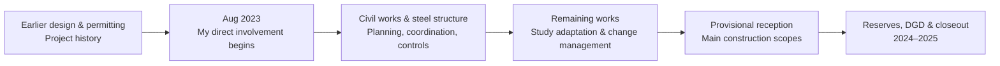

# New Meter Manufacturing Facility — Project Management Case Study

From **August 2023 to May 2025**, I worked on the owner side of the construction and delivery of a new **gas and electricity meter manufacturing facility in TABEL, Oran, Algeria**, at **SAIEG — Sonelgaz Group**.

My formal company title remained **Ingénieur d'études**. In practice, I handled day-to-day project-management responsibilities across planning, contracts, technical coordination, cost follow-up, reporting, risks, reception and closeout.

## At a glance

| Area | Details |
|---|---|
| Organization | SAIEG — Sonelgaz Group |
| Location | TABEL, Oran, Algeria |
| My direct involvement | August 2023 – May 2025 |
| Formal company title | Ingénieur d'études |
| Project function | Owner-side project coordination and delivery |
| Facility | Gas and electricity meter manufacturing |
| Contract structure | Four core contractor / engineering-consultant streams |
| Main scope | Planning, contracts, technical coordination, cost monitoring, procurement, reporting, risk/issue follow-up, reception and closeout |

During the same period, I also covered the **Development Department head role on three short interim assignments**, alongside my core responsibilities.

## Delivery context

The project had already passed through early design and administrative stages before I joined it. My direct involvement began in August 2023, as execution and owner-side coordination became the main focus.

The delivery period involved two contractor scopes and two engineering-consultant / BET contract streams, together with technical-control, laboratory, procurement and internal stakeholders.

## My responsibilities

### Planning, progress and executive reporting

I collected project information from several parties, monitored schedules and physical progress, followed open actions, and maintained recurring project-status reporting.

I personally prepared and updated the project presentations used for management follow-up and regularly presented progress, issues and actions to executive management. I also prepared recurring monthly and group-level reporting.

### Contracts, changes and documentation

I worked across the four core contract streams and prepared or maintained a substantial share of the owner-side project documentation.

That work included:

- contract execution follow-up;
- amendments and closing amendments;
- additional and complementary works;
- work orders;
- stop / resume controls;
- time and scope impacts;
- price discussions;
- work situations and final-account documentation.

### Procurement, specifications and selection

Preparing procurement and specification documents was a recurring part of my work, not a one-off task.

For the TABEL project, I prepared or substantially contributed to several **cahiers des charges**, consultation and contract packages, including the engineering-consultant / BET package and selected technical infrastructure packages. I also participated in contractor and consultant selection, technical offer evaluation and negotiation activities.

### Technical coordination and drawing follow-up

I coordinated execution issues across civil works, steel structure, architecture, electrical systems, HVAC, fire protection, utilities and other technical packages.

Project drawings were part of the day-to-day follow-up: I reviewed them, used them to understand interfaces and execution constraints, and coordinated study gaps, modifications and technical-control observations with the relevant parties.

### Cost and payment monitoring

I maintained project-level financial follow-up covering contract status, amendments, work situations, invoices, forecasts and final-account information.

The objective was to keep financial status visible alongside physical progress, contractual changes and remaining commitments.

### Risk, issue and delay management

A representative issue combined delayed steel-structure procurement with a design conflict around a freight-lift / foundation interface.

The situation required coordination between the contractor, engineering parties and technical control, design correction, schedule-impact follow-up and handling of complementary works. Lessons from that phase were carried into the later contract scope by strengthening study adaptation and asking for earlier identification of plan gaps.

## Project progression

The archive documents the project from early execution through later delivery.

**Early execution — October 2023**

**Later production areas**

## Reception and closeout

The two main contractor scopes reached **provisional reception**. Follow-up then continued through reserve resolution, final-account work, closing amendments and contract / financial closeout.

## Documentation

This case study is grounded in a large surviving project archive covering schedules, progress trackers, meeting and negotiation minutes, contract/change documents, financial monitoring, technical evaluations, project presentations, reception/closeout records and project-history material.

The repository uses selected project views and summarized evidence rather than publishing raw contracts, detailed financial records, private correspondence or technical drawings.

See:

- [Delivery & Controls](docs/delivery-and-controls.md)
- [Evidence & Confidentiality](evidence/README.md)
